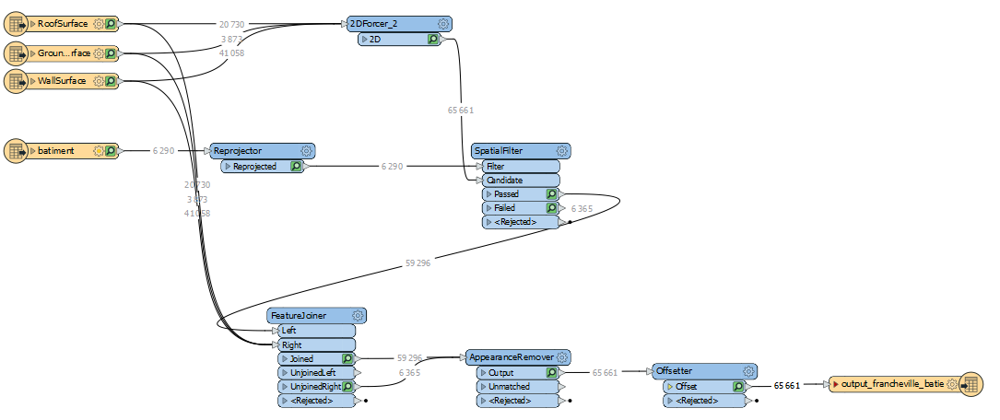

# Application 3D de Visualisation du Bâti - Francheville

## Description du Projet

Cette application web interactive permet de visualiser en 3D le bâti de la commune de Francheville à l'aide de CesiumJS. Les données sont présentées sous forme de tuiles 3D (3D Tiles) au format Cesium avec une colorisation thématique basée sur l'usage des bâtiments.

## Objectifs

- Visualiser le bâti en 3D sur un globe virtuel
- Différencier visuellement les bâtiments selon leur usage
- Offrir une interface interactive pour explorer les données urbaines
- Fournir une légende claire pour faciliter la lecture de la carte

## Méthodologie de Traitement des Données

### Workflow FME - Traitement du Bâti



Le traitement des données du bâti s'effectue en plusieurs étapes via FME (Feature Manipulation Engine) :

#### 1. **Extraction des Surfaces**
- **RoofSurface** : Extraction des surfaces de toit (3255 features)
- **GroundSurface** : Extraction des surfaces au sol (1058 features)
- **WallSurface** : Extraction des murs (4 features)

Ces surfaces proviennent de modèles CityGML qui décrivent la géométrie 3D des bâtiments.

#### 2. **Reprojection**
Les données sont reprojetées dans le système de coordonnées approprié pour assurer la cohérence spatiale avec le globe Cesium.

#### 3. **Jointure Spatiale (SpatialFilter)**
Un filtre spatial permet d'associer les surfaces de bâtiments avec les données attributaires du bâti (6250 features en entrée, 6365 features après traitement). Cette étape permet de :
- Identifier les bâtiments présents dans la zone d'étude
- Filtrer les données selon des critères géographiques
- Séparer les features acceptées, rejetées et en attente

#### 4. **FeatureJoiner**
Cette étape cruciale joint les géométries 3D avec les attributs sémantiques des bâtiments, notamment :
- **USAGE1** : Usage principal du bâtiment (Résidentiel, Commercial, Industriel, etc.)
- Autres attributs métier

Le joineur produit :
- **Joined** : Bâtiments avec attributs associés (69296 features)
- **Unjoined** : Entités non appariées (5365 features)

#### 5. **AppearanceRemover**
Suppression des apparences d'origine des modèles CityGML pour permettre une stylisation personnalisée basée sur les attributs.

#### 6. **Offsetter**
Ajustement de l'altitude des bâtiments si nécessaire pour garantir un positionnement correct sur le terrain.

#### 7. **Export en 3D Tiles**
Les données sont finalement exportées au format Cesium 3D Tiles (65661 features) pour une visualisation optimisée dans CesiumJS.

## Représentation du Bâti sur la Carte

### Choix de Colorisation

Nous avons choisi de représenter les bâtiments avec une **colorisation thématique basée sur l'attribut USAGE1**. Ce choix offre plusieurs avantages :

#### Pourquoi cette représentation ?

1. **Lisibilité Urbaine** : Les différentes couleurs permettent d'identifier instantanément la fonction d'un quartier (résidentiel, commercial, industriel).

2. **Analyse Spatiale** : Cette visualisation facilite l'analyse de la répartition des usages sur le territoire :
   - Identification des zones monofonctionnelles
   - Détection des zones mixtes
   - Compréhension de l'organisation urbaine

3. **Communication** : La carte devient un outil de communication efficace pour :
   - Les urbanistes et aménageurs
   - Les élus municipaux
   - Le grand public

4. **Différenciation Visuelle** : Chaque usage dispose d'une couleur distinctive :
   - 🔵 **Résidentiel** (#3498db) - Bleu : zones d'habitation
   - 🔴 **Industriel** (#e74c3c) - Rouge : sites de production
   - 🟠 **Commercial** (#f39c12) - Orange : commerces et services
   - 🟢 **Agricole** (#27ae60) - Vert : bâtiments agricoles
   - 🟣 **Religieux** (#9b59b6) - Violet : édifices religieux
   - 🔷 **Sportif** (#1abc9c) - Turquoise : équipements sportifs
   - ⚪ **Annexe** (#95a5a6) - Gris : dépendances
   - ⚫ **Non défini** (#bdc3c7) - Gris clair : usage inconnu

### Code de Stylisation (Cesium3DTileStyle)

```javascript
tileset.style = new Cesium3DTileStyle({
  color: {
    conditions: [
      ["${USAGE1} === 'Résidentiel'", "color('#3498db')"],
      ["${USAGE1} === 'Industriel'", "color('#e74c3c')"],
      ["${USAGE1} === 'Commercial'", "color('#f39c12')"],
      ["${USAGE1} === 'Agricole'", "color('#27ae60')"],
      ["${USAGE1} === 'Religieux'", "color('#9b59b6')"],
      ["${USAGE1} === 'Sportif'", "color('#1abc9c')"],
      ["${USAGE1} === 'Annexe'", "color('#95a5a6')"],
      ["${USAGE1} === null", "color('#bdc3c7')"],
      ["true", "color('#ff0000')"]
    ]
  }
});
```

Cette approche par conditions permet une grande flexibilité et peut être facilement adaptée pour d'autres critères de visualisation (hauteur, année de construction, état du bâti, etc.).

## Installation

### Prérequis
- Node.js (version 16 ou supérieure)
- npm ou yarn

### Installation des dépendances

```bash
cd webpack-5
npm install
```

## Lancement de l'Application

### Démarrer le serveur de développement

```bash
npm start
```

L'application sera accessible à l'adresse : `http://localhost:8080`

## Structure du Projet

```
webpack-5/
├── public/
│   ├── francheville_comm.geojson          # Limites communales
│   └── output_francheville_batie/         # Tuiles 3D du bâti
│       ├── tileset.json                   # Index des tuiles
│       └── data/                          # Fichiers .b3dm
├── src/
│   ├── index.html                         # Page HTML principale
│   ├── index.js                           # Code JavaScript Cesium
│   └── css/
│       └── main.css                       # Styles CSS
├── package.json                           # Dépendances npm
└── webpack.config.js                      # Configuration Webpack
```

## Technologies Utilisées

- **CesiumJS** : Bibliothèque de visualisation 3D géospatiale
- **Webpack** : Bundler de modules JavaScript
- **FME** : Outil de transformation de données géospatiales
- **3D Tiles** : Format de tuiles 3D pour la visualisation performante

## Données Source

- Format d'origine : CityGML
- Système de coordonnées : [À préciser]
- Couverture : Commune de Francheville
- Attributs : USAGE1, géométries 3D (toits, murs, sols)

## Auteurs

VALENTIN Paul ; 
HERMAN Nicolas ; 
THIBAUDON Arthur

---

**Note** : Ce projet a été développé dans le cadre d'un Master 2 en géomatique.